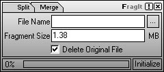

## \[ FragIt v1\.1 \]\- It is now more enhanced and, safe and more reliable in both spliting and merging\.

### Description

FragIt is now more enhanced and more reliable. Including safe data handling and in this release the fraging (splitting) limit is broken, means you can now break a file into unlimited fragments. You can control the fragment file number with the fragment size only and nothing else. Don't lose focus on the new on-the-fly canceling option. Now for the unlimited fraging capability you might end up fraging your 2MB file into 2097152 fragments and it really takes a while. When you hit the Initialize button it changes into cancel button. So using this new cancel option you can cancel both split and merge actions on-the-fly and there is no data lose! Cool Hah?

It would be nice if you VOTE for me. There is a lot of hard work involved in this project.
 
### More Info
 

             |
---                |---
**Submitted On**   |2002-07-02 14:54:44
**By**             |[Zubuyer Kaolin](https://github.com/Planet-Source-Code/PSCIndex/blob/master/ByAuthor/zubuyer-kaolin.md)
**Level**          |Advanced
**User Rating**    |4.9 (191 globes from 39 users)
**Compatibility**  |VB 6\.0
**Category**       |[Files/ File Controls/ Input/ Output](https://github.com/Planet-Source-Code/PSCIndex/blob/master/ByCategory/files-file-controls-input-output__1-3.md)
**World**          |[Visual Basic](https://github.com/Planet-Source-Code/PSCIndex/blob/master/ByWorld/visual-basic.md)
**Archive File**   |[\[\_FragIt\_v100490712002\.zip](https://github.com/Planet-Source-Code/zubuyer-kaolin-fragit-v1-1-it-is-now-more-enhanced-and-safe-and-more-reliable-in-both-spli__1-36427/archive/master.zip)

